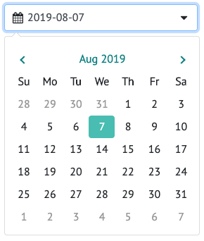
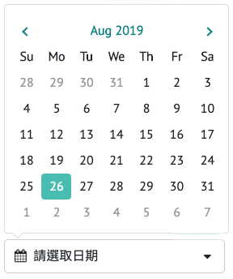
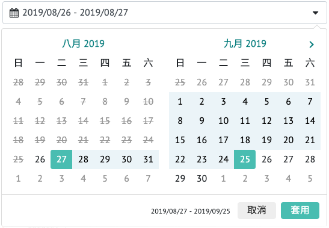
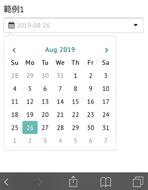
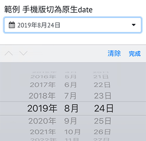
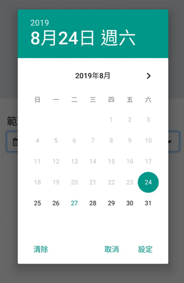

# Date Range Picker 範例

 [Date Range Picker (官網)](https://www.daterangepicker.com/) 是一個可用小月曆選取日期的套件，本文將解說：
 * [Setting up](#setting-up)
 * [Single Date](#single-date)
 * [Date Range](#date-range)
 * [Mobile Mode](#mobile-mode)

> [Date Range Picker 範例 @lottevic](https://lottevic.github.io/date-range-picker-ex/src/)   
>  

##  Setting up
```html
  <!-- css -->
  <link rel="stylesheet" href="https://cdn.jsdelivr.net/npm/daterangepicker/daterangepicker.css">
  <!-- js  -->
  <script src="https://ajax.googleapis.com/ajax/libs/jquery/3.4.1/jquery.min.js"></script>
  <script src="https://cdn.jsdelivr.net/momentjs/latest/moment.min.js"></script>
  <script src="https://cdn.jsdelivr.net/npm/daterangepicker/daterangepicker.min.js"></script>
```
* 說明: 經實測，使用舊版Jquery也可以
```html
  <script src="https://ajax.googleapis.com/ajax/libs/jquery/1.11.1/jquery.min.js"></script>
```
* 說明: date range picker 需引用 [moment.js](https://momentjs.com/) ，是一個時間相關函數的js。

##  Single Date
### 1. 設定在 `<input> `物件上: 




```html
<input type="text" name="NAME_ONE_DATE1" class="..." value="">
```
```javascript
$('input[name="NAME_ONE_DATE1"]').daterangepicker({
    singleDatePicker: true, //設置為單一日期
    locale: {
      format: 'YYYY-MM-DD'
    }
});
```
*  [範例](https://lottevic.github.io/date-range-picker-ex/src/)   
*  注意: 在手機上需特別處理input鍵盤 (參見[Mobile Mode](#mobile-mode))

### 2. 設定在 `<span> `物件上:
| 選取前        | 選完後           | 
| ------------- |:-------------:| 
|  |   | 

```html
<div id="ID_DATE"  class="...">
    <div class="...">
      <i class="fa fa-calendar lotte-icon"></i> 
      <span class="">請選取日期</span>
    </div>
    <i class="fa fa-caret-down lotte-icon"></i>
</div>
```
```javascript
var start = moment();  
$('#ID_DATE').daterangepicker({ 
  singleDatePicker: true,
  drops: 'up',
}, function (start) {
  $('#ID_DATE span').html(start.format('YYYY/MM/DD')); //將日期寫入span
});
```
*  [範例](https://lottevic.github.io/date-range-picker-ex/src/)  
    
##  Date Range
| 選取前        | 選完後           | 
| ------------- |:-------------:| 
|  |   |

 ```html
<input type="text" name="NAME_TWO_DATE1" class="..." value="">
```
```javascript
$('input[name="NAME_TWO_DATE1"]').daterangepicker({
  minDate: moment().startOf('day'),  //限制開始日期-今日
  maxDate: '2019-10-20', //限制結束日期
  startDate: moment(), //起始日
  endDate: moment().add(1, 'days'), //終止日
  buttonClasses: "lotte-btn",
  applyButtonClasses: "lotte-btn-apply",
  cancelButtonClasses: "lotte-btn-cancel", 
  opens: 'left',      
  locale: {
    applyLabel: "套用",
    cancelLabel: "取消",
    format: 'YYYY/MM/DD',
    daysOfWeek: ["日", "一", "二", "三", "四", "五", "六"],
    monthNames: ["一月", "二月", "三月", "四月", "五月", "六月", "七月", "八月", "九月", "十月", "十一月", "十二月"]
  }
}, function(start, end, label) {
    console.log("已選擇 開始日期: " + start.format('YYYY/MM/DD') + '結束日期: ' + end.format('YYYY/MM/DD'));
});
```
 *  [範例](https://lottevic.github.io/date-range-picker-ex/src/index2.html)  
 


##  Mobile Mode
### 1.擋掉 input 鍵盤!
| 修正前        | 修正後           | 
| ------------- |:-------------:| 
|  |   | 


```html
<input type="text" name="NAME_ONE_DATE1" class="lotte-input-date" value="">
<input type="text" name="NAME_ONE_DATE2" class="lotte-input-date" value="">
...
```
```javascript
//強制關閉手機input keyboard
$('input.lotte-input-date').on('show.daterangepicker', function(ev, picker) { 
  //當打開小月曆時，
  var myinput = $(this);
    myinput.blur(); //將手機keyboard關閉
    myinput.attr('disabled', 'disabled'); //將input設置為disable狀態，(鎖住) 避免再次點擊到而打開手機keyboard
});
$('input.lotte-input-date').on('hide.daterangepicker', function(ev, picker) { 
  //當關閉小月曆時，
  var myinput = $(this);
  myinput.removeAttr('disabled'); //取消input的disable狀態 (解鎖)
});
```
*  [範例](https://lottevic.github.io/date-range-picker-ex/src/)  


### 2.切換為`原生`日期選取模式

| iOS        | Android           | 
| ------------- |:-------------:| 
|  |   | 

```html
<div class="lotte-date">
  <!-- 只顯示於pc mode -->
  <input type="text" name="NAME_ONE_DATEX" class="form-control lotte-input-date lotte-pc-only" value="">
  <!-- 只顯示於mobile mode -->
  <input type="date" name="NAME_ONE_DATEX_MOBI" class="form-control lotte-input-date lotte-mobile-only" value="2019-08-24" min="2019-08-24" max="2019-09-12">
</div>
```
```javascript
$('input[name="NAME_ONE_DATEX"]').daterangepicker({
  singleDatePicker: true,
  locale: {
    format: 'YYYY-MM-DD'
  }
}, function (start) {
    console.log("已選擇日期: " + start.format('YYYY-MM-DD'));
});

$('input[name="NAME_ONE_DATEX_MOBI"]').change(function() {
    var start = $('input[name="NAME_ONE_DATEX_MOBI"]').val();
    console.log("已選擇日期: " + start)
});
```
*  [範例](https://lottevic.github.io/date-range-picker-ex/src/index3.html)  


##  其他類似功能 js
* 統一為popup月曆 - [pickdate.js](https://amsul.ca/pickadate.js/)
